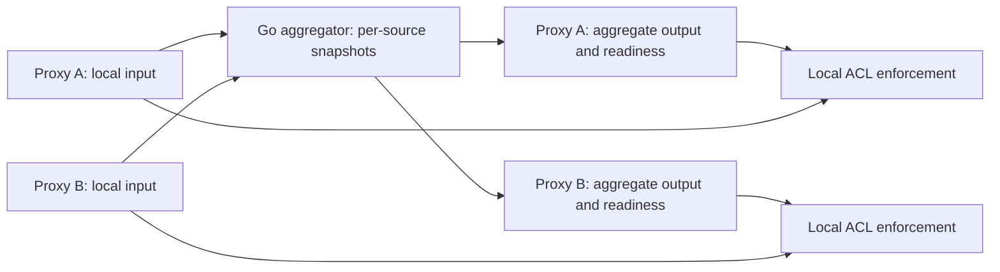

# HAProxy Table Aggregator Implementation Plan

## Implementation checklist

- [x] [00 — Development tooling](00-dev-tooling.md)
- [x] [01 — Reproducible local lab](01-local-lab.md)
- [x] [02 — Wire framing and integers](02-wire-framing.md)
- [x] [03 — Table and entry messages](03-table-messages.md)
- [x] [04 — Peer sessions](04-peer-sessions.md)
- [x] [05 — Output tables and isolation](05-output-isolation.md)
- [x] [06 — Freshness feasibility gate](06-freshness-gate.md)
- [x] [07 — Source snapshots](07-source-snapshots.md)
- [x] [08 — Counter aggregation](08-counter-aggregation.md)
- [ ] [09 — Rate evaluation](09-rate-evaluation.md)
- [ ] [10 — Publication and enforcement](10-publication-enforcement.md)
- [ ] [11 — Restart and reconnect recovery](11-recovery.md)
- [ ] [12 — Reload continuity gate](12-reload-continuity.md)
- [ ] [13 — Mutual TLS and peer authorization](13-peer-security.md)
- [ ] [14 — Resource bounds](14-resource-bounds.md)
- [ ] [15 — Operational visibility](15-observability.md)
- [ ] [16 — Failure qualification](16-failure-qualification.md)
- [ ] [17 — Upstream compatibility and CI](17-compatibility-ci.md)
- [ ] [18 — Load qualification](18-load-qualification.md)
- [ ] [19 — Staging shadow preparation](19-staging-shadow.md)

This checklist is the at-a-glance progress tracker. Tick a phase's box in the
same change that marks its phase file `complete`, and only then. **Record all
other planning and progress in the relevant phase file:** its status,
acceptance checkboxes, decisions, commands, results, and handoff. Do not append
execution logs to this README. Each phase file is the authoritative record of
that phase's completion; the checklist mirrors it.

## Purpose and current status

An MIT-licensed Go service for cluster-wide HAProxy request-rate aggregation
and abuse protection. This repository currently contains the agreed design
and implementation plan; no implementation or compatibility result is claimed.
Design agreed on 2026-10-03.

HAProxy peers replicate table values by overwriting remote values. They do not
sum concurrent contributions from several active proxies. This service keeps
each proxy's contribution separate, calculates an aggregate, and publishes it
back to ordinary HAProxy stick tables for local ACL decisions.

**The application is an ordinary peers-protocol receiver and sender. It must
work with unmodified HAProxy Community. No HAProxy patch, enterprise module,
protocol extension, or per-request call to the aggregator is required by the
design.** HAProxy configuration changes are required. Compatibility is a test
gate, not something established by this design document.

## Scope

The initial target is 2–10 proxies connected by a low-latency network in one
region. Start with one logical request-tracking category, IPv6 table keys,
`http_req_cnt`, and `http_req_rate(period)`. Use a 10-second period in fast lab
tests and repeat qualification with 60 seconds. Example request rules preserve
IPv4 addresses and mask IPv6 addresses to /64 with `src,ipmask(32,64)`.

The request count is a diagnostic for snapshot correctness, not a durable
lifetime total. General-purpose integer fields in a separate output table hold
the evaluated rate. A metadata table may hold readiness information; this does
not make the experiment a second traffic category. Final field layout is fixed
and tested in phases 05–06. Native rate-field output is deferred.

Error and glitch rates are natural later extensions. Initial non-goals are
historical analytics, exact distributed quotas, billing counters, persistent
storage, redundant aggregators, automatic discovery, cross-region operation,
and arbitrary stick-table data types. Guard verification, maintenance bypass,
and backend/session affinity remain ordinary replicated state outside this
service's initial scope.

## Data flow and ownership

Each proxy has a dedicated peer relationship with the aggregator. Input tables
are not replicated between those proxies. Output tables have distinct names
and are never tracked or incremented by request rules. Existing shared tables
cannot simply be connected to the aggregator and summed: their contributions
are already mixed.

The aggregator never writes merged values into input tables and never treats
received output or readiness records as input. `recv-only` is not a transport
ACL and does not establish either property. Isolation is enforced by topology,
table names, schema validation, and application behavior.

Sources have configured logical names. Process IDs and connections identify
sessions, not additional contributors. Table IDs are session-local; table
names, key schemas, and periods determine semantic compatibility. Source
membership is explicit configuration, not inferred from whichever peers happen
to be connected.

## Accounting contract

- Keep the latest accepted snapshot for each source/table/key. Replace that
  source's contribution before summing; never sum successive absolute snapshots.
- Preserve periods, reception times, and remaining lifetimes. Evaluate each
  source's native rate estimate at a common monotonic time, then sum those
  estimates. Do not add raw window fields or compare wire ages as timestamps.
- The published unit is **estimated requests per configured period**, not
  requests per second. Native HAProxy rates are estimates, not an exact trailing
  event log. Specify rounding against native HAProxy behavior in phase 09.
- Rates must decay during silence; publication cannot depend only on new input.
  Expired state must not be resurrected or have its lifetime extended by replay.
- Replay, resynchronization, and normal reload must not double-count inherited
  state. Successful reload continuity is a separate hard compatibility gate.
- Recovery can restore retained source snapshots. It cannot restore history
  already expired, evicted, or lost in a source crash. Eviction and cold restart
  uncertainty must be tested and documented, not called durable accounting.
- Use checked arithmetic. Unsupported schemas, ambiguous recovery, and values
  that cannot fit the chosen output fields must not silently wrap or appear as
  complete, trustworthy output.

## Readiness and enforcement contract

Run one in-memory process initially. On restart it requests a full snapshot
from every required source. Aggregate authority requires all required sources
to be synchronized and healthy, plus sufficiently current publication to the
receiving proxy. A connected socket, a heartbeat, or one completed snapshot
alone cannot establish that condition. Quiet sources remain healthy; last
entry-update time is not a source-health check.

If a required source is missing, recovering, or known to have incomplete state,
global enforcement falls back to local protection. Do not present a partial
aggregate as complete. Backlogs and resource exhaustion also invalidate
authority. A slow destination must not block healthy destinations.

Every proxy keeps its local limit active. When aggregate data is authoritative,
either the local limit or the aggregate limit can reject a request. During
fallback, each proxy retains the full configured limit; the limit is not divided
by cluster size. This favors availability and can permit a higher cluster total
during degradation. All enforcement remains local to HAProxy.

Starting acceptance targets, configurable and subject to demonstrated bounds:

| Condition                     | Target                                          |
| ----------------------------- | ----------------------------------------------- |
| Healthy update propagation    | p99 at most 250 ms under the declared benchmark |
| Aggregate publication stops   | Authority expires locally within 2 seconds      |
| Silent source/network failure | Local fallback within 10 seconds                |

Freshness must cover data progress, not just a periodically updated marker.
Phase 06 must prove that reload, resync replay, stalled delivery, or delayed
readiness messages cannot renew stale authority. Lease encoding is deliberately
a feasibility gate. If the stock protocol/configuration cannot satisfy the
contract, stop and revisit the contract with the owner; do not silently add a
patch dependency or weaken the targets. Latency targets are not measurements.

## Security and compatibility

Supported deployments beyond an isolated loopback lab require mutual TLS,
verification of both ends, and configured peer authorization. Bind the claimed
logical peer name to an allowed certificate identity. Plaintext requires an
explicit local-test option. Generate disposable test credentials locally;
never commit operational private keys or credentials.

Initial upstream test targets are **3.4.6 and 3.2.25**, pinned by exact source
or artifact digest with build options recorded. Both are proposed targets,
not a support claim. A patched local binary may be an additional regression
comparison, but cannot satisfy the upstream gate. Known upstream defects get
minimal reproductions and explicit results. A failing release is not declared
supported; a required contract change goes back to the owner.

The public lab must accept an explicit HAProxy executable or reproducibly built
pinned artifact and run without this Ansible repository, infrastructure access,
Bitwarden, real client data, or proprietary fixtures. Linux is the first lab
and deployment target. Phase 00 pins the Go toolchain in `go.mod` rather than
assuming the original author's installed toolchain is current.

## Working through the plan

Work in numbered order unless a phase explicitly names another dependency.
Read this contract and the current phase before editing code. Each phase has
one bounded outcome intended for one implementation turn, not a promise about
elapsed time. Do not start the next phase automatically.

Use `not started`, `in progress`, `blocked`, or `complete` in the phase file.
Mark a phase complete only when every required acceptance item passes. Record
exact commands, versions, concise evidence, limitations, and the next action
in that file. Store large generated results in ignored artifacts and link them;
retain small synthetic regression fixtures where appropriate. A passing local
experiment is not production qualification.

If a phase is too large or hits an unresolved feasibility question, stop with a
concrete handoff in that phase. Keep stable filenames and add bounded substeps
there rather than silently broadening the turn or growing this README. Contract
changes need an explicit owner decision; progress detail belongs in phase files,
not here, beyond ticking the checklist.
Do not commit, publish, create a remote repository, or deploy automatically.

## License and reference material

New project code and these documents use the [MIT license](../../LICENSE). Write
original Go code and fresh test fixtures. Referencing a protocol or observing
behavior does not mean copying its implementation. Do not relicense copied or
translated third-party code as MIT; evaluate and record any proposed reuse
separately, retaining applicable notices and terms.

The existing Node/TypeScript project originated with WoltLab and is
LGPL-3.0-or-later. It is useful research material, not the specification for
aggregation correctness. Its encoder/parser round trips are not an independent
HAProxy compatibility oracle. The public tests will generate their own evidence.

- [HAProxy stick-table configuration](https://docs.haproxy.org/3.4/configuration.html#11.1)
- [HAProxy peers configuration](https://docs.haproxy.org/3.4/configuration.html#11.2)
- [Upstream peers protocol specification](https://github.com/haproxy/haproxy/blob/master/doc/peers.txt)
- [Upstream rate-counter implementation](https://github.com/haproxy/haproxy/blob/master/src/freq_ctr.c)
- [Upstream release matrix](https://www.haproxy.org/#latest)
- [MIT license text](https://opensource.org/license/mit)

Pin version-specific protocol references and capture provenance in the lab;
the moving upstream links above are starting references, not frozen fixtures.
